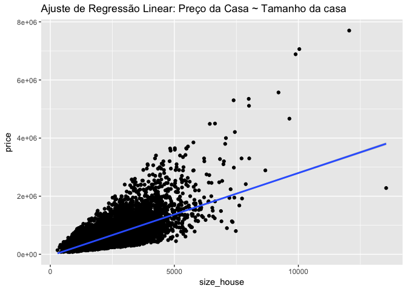
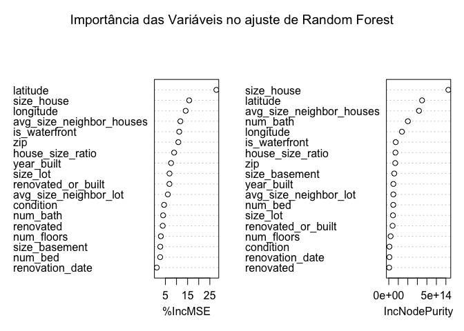

Nextel - Case
================
Rafael Meirelles

Dependências
============

Importarndo dependências

``` r
library(readr)
library(dplyr)
library(ggplot2)
library(Metrics)
library(randomForest)
library(FNN)
library(xgboost)
```

Importando dados.

``` r
house_sales <- read_csv("~/Downloads/data_scientist_test/house_sales.csv")
```

EDA - Análise Descritiva
========================

Nesse gráfico (para análise ampliei o plot para melhor vizualização) tentaremos observar quais as varáveis possuem notável correlação a ser considerada com a variável resposta (preço) e ainda eventuais variáveis que contém informações equivalentes. Em seguida a matriz de correlação é mostrada com o objetivo de quantificar essas relações:

Observa-se que algumas variáveis referentes a especificações das propriedades em questão apresentam relação direta (correlação positiva) em níveis bastante expressivos como é o caso de número de quartos, número de banheiros , tamaho da casa, andares, presença de fonte e tamanho do porão (0.30, 0.52, 0.70, 0.25, 0.27, 0.32 respectivamente). Tais variáveis tem sua relação com o preço da casa facilmente justificado e provavelmente são considerados pelo comprador no momento da compra. Observamos ainda que existe uma considerável correlação entre essas variáveis já que, por exemplo, casas com muitos quartos tendem a ter muitos banheiros. É importante considerar essa informação para evitar problemas como colinearidade durante a modelagem. Observe no exemplo a seguir como seria um ajuste do preço da propriedade pelo tamanho da mesma:

``` r
ggplot(house_sales,aes(y=price,x=size_house)) + geom_point() + stat_smooth(method = "lm") + ggtitle("Ajuste de Regressão Linear: Preço da Casa ~ Tamanho da casa")
```



Fica claro que a variável consegue captar parte da variabilidade da variável resposta mas que ainda é necessário encontrar outras variáveis para complementar a análise.

O tamanho médio das casas vizinhas apesar de não ser uma informação específica da casa em questão, provavelmente revela muito sobre a região da casa e por isso mostra-se relevante, apresentando correlação de 0.58. Fica claro ainda que existe uma elevada homogeneidade entre as casas vizinhas já que o tamanho das casas vizinhas e o tamanho da casa em qustão possuem correlação na casa de 0.75. A seguir iremos tentar integrar essas duas variáveis em uma nofa feature.

Curiosamente a latitude apresenta uma correlação expressiva, na casa de 0.30. Sabendo que se tratam de propriedades nos Estados Unidos, isso significa que propriedades mais ao norte tendem a ser mais caras do que as mais ao sul.

As variáveis restantes não apresentaram correlação relevante (em módulo).

Seguem abaixo algumas variáveis potencialmente relevantes que podem ser criadas a partir da base fornecida:

**house\_size\_ratio**: Diante do fato de que tanto o tamanho casa quanto o tamanho das casas vizinhas se mostrou muito relacionado em termos de correlação com o preço da casa, uma hipótese é de que o a razão entre essas duas variáveis também se prove relevante (mostraria qual o tamanho do imóvel em questão quando comparado a)

**renovated**: 1 se a casa passou por renovação e 0 caso contrário

**renovated\_or\_built**: variável contém quantos anos se passaram desde a construção ou renovação, o que ocorreu mais recentemente (estamos aqui supondo que o ano corrente é 2016 já que os últimos registros de construção e renovação datam de 2015).

Abaixo criamos as variáveis citadas e perfomamos a normalização das variáveis para a utilização em alguns modelos específicos.

``` r
house_sales = 
house_sales %>%
  mutate(house_size_ratio = size_house/avg_size_neighbor_houses,
         renovated = ifelse(renovation_date == 0, 0, 1),
         renovated_or_built = 2016 - ifelse(renovation_date == 0 , year_built, renovation_date))

norm_house_sales =  as.data.frame(cbind(house_sales[,1],scale(house_sales[,-1])))

cor(house_sales)[,"price"]
```

    ##                    price                  num_bed                 num_bath 
    ##               1.00000000               0.30847753               0.52892138 
    ##               size_house                 size_lot               num_floors 
    ##               0.70558649               0.09073071               0.25900300 
    ##            is_waterfront                condition            size_basement 
    ##               0.27622988               0.03497410               0.32461980 
    ##               year_built          renovation_date                      zip 
    ##               0.05405205               0.12811774              -0.04982628 
    ##                 latitude                longitude avg_size_neighbor_houses 
    ##               0.30653474               0.02204813               0.58429968 
    ##    avg_size_neighbor_lot         house_size_ratio                renovated 
    ##               0.08377319               0.30604996               0.12776784 
    ##       renovated_or_built 
    ##              -0.10643423

Observamos que as variáveis house\_size\_ratio, renovated e renovated\_or\_built apresentaram correlação de 0.30, 0.12 e -0.10. As variáveis relacionadas a renovação não revelam muito potencial preditivo mas é possível que integradas com as já existentes possam melhorar o desempenho preditivo.

Modelagem
=========

Agora que desenvolveu-se algum entendimento sobre o conjunto de dados, vamos seguir com a modelagem adequada.

Inicialmente vamos separar o conjunto de dados em conjundo de treinamento (85%) e conjunto de teste (15%).

Em seguida realizaremos um ajuste base utilizando regressão linear para analisar o comportamento das variáveis e seguiremos com a utilização de modelos mais complexos como Random Forest, KNN e XGBoost.

Separando conjuntos de treino e teste:

``` r
set.seed(1234)
training_samples = sample(nrow(house_sales),0.85*nrow(house_sales))
train = house_sales[training_samples,]
test = house_sales[-training_samples,]

norm_train = norm_house_sales[training_samples,]
norm_test = norm_house_sales[-training_samples,]
```

Regressão Linear
================

Para este primeiro modelo iremos colocar todas as variáveis fornecidas juntamente com as criadas e analisar o desempenho. Obviamente seria necessário revisar quais variáveis realmente fazem sentido entrar no modelo e constatar quais podem ser colineares entre si. No entanto or questões de prazo e como o objetivo nesse momento é o desenvolvimento de um modelo base para podemos avaliar outros ajustes mais complexos, isso não será feito.

``` r
ajuste_lm = lm(price~.,data=train)
summary(ajuste_lm)
```

    ## 
    ## Call:
    ## lm(formula = price ~ ., data = train)
    ## 
    ## Residuals:
    ##      Min       1Q   Median       3Q      Max 
    ## -1967289  -107802    -9760    83104  3674435 
    ## 
    ## Coefficients:
    ##                            Estimate Std. Error t value Pr(>|t|)    
    ## (Intercept)              -1.630e+07  3.664e+06  -4.449 8.70e-06 ***
    ## num_bed                  -4.252e+04  2.332e+03 -18.232  < 2e-16 ***
    ## num_bath                  5.624e+04  4.067e+03  13.829  < 2e-16 ***
    ## size_house                3.908e+02  8.109e+00  48.189  < 2e-16 ***
    ## size_lot                  1.620e-01  6.080e-02   2.665 0.007712 ** 
    ## num_floors                2.802e+04  4.478e+03   6.258 4.01e-10 ***
    ## is_waterfront             7.828e+05  2.037e+04  38.426  < 2e-16 ***
    ## condition                 3.284e+04  2.940e+03  11.172  < 2e-16 ***
    ## size_basement            -4.370e+01  5.319e+00  -8.216 2.26e-16 ***
    ## year_built               -1.619e+03  3.769e+02  -4.295 1.76e-05 ***
    ## renovation_date           4.440e+03  5.871e+02   7.563 4.15e-14 ***
    ## zip                      -5.362e+02  4.085e+01 -13.126  < 2e-16 ***
    ## latitude                  6.567e+05  1.314e+04  49.979  < 2e-16 ***
    ## longitude                -3.347e+05  1.633e+04 -20.490  < 2e-16 ***
    ## avg_size_neighbor_houses -7.529e+01  8.765e+00  -8.589  < 2e-16 ***
    ## avg_size_neighbor_lot    -3.080e-01  9.156e-02  -3.363 0.000772 ***
    ## house_size_ratio         -2.988e+05  1.494e+04 -19.995  < 2e-16 ***
    ## renovated                -8.770e+06  1.163e+06  -7.539 5.00e-14 ***
    ## renovated_or_built        4.125e+02  3.855e+02   1.070 0.284707    
    ## ---
    ## Signif. codes:  0 '***' 0.001 '**' 0.01 '*' 0.05 '.' 0.1 ' ' 1
    ## 
    ## Residual standard error: 213800 on 15661 degrees of freedom
    ## Multiple R-squared:  0.672,  Adjusted R-squared:  0.6717 
    ## F-statistic:  1783 on 18 and 15661 DF,  p-value: < 2.2e-16

``` r
predict_lm = predict(object = ajuste_lm, test)

print(paste("RMSE obtido no conjunto de teste COM REGRESSÃO LINEAR:",rmse(actual = test[,"price"],predict_lm)))
```

    ## [1] "RMSE obtido no conjunto de teste COM REGRESSÃO LINEAR: 207626.754152756"

Observe que por meio da regressão linear e das variáveis utilizadas foi possível explicar 66% da variabilidade do preço dos imóveis, o que é um resultado bastante aceitável (e que obviamente pode ser melhorado). Nesse modelo base o RMSE obtido foi de 235624.5 no conjunto de testes.

Random Forest
=============

Observe agora os resultados obtidos por meio de um modelo de Floresta Aleatória:

``` r
ajuste_rf = randomForest(price ~ .,
                      data=train, 
                      importance=TRUE, 
                      ntree=30)


predict_rf = predict(object = ajuste_rf, test)

print(paste("RMSE obtido no conjunto de teste RANDOM FOREST:",rmse(actual = test[,"price"],predict_rf)))
```

    ## [1] "RMSE obtido no conjunto de teste RANDOM FOREST: 127356.601027138"

``` r
varImpPlot(ajuste_rf,main = "Importância das Variáveis no ajuste de Random Forest")
```



Note que foi possível abaixar consideravelmente o RMSE, o que sugere que existem muitas relações não lineares que a regressão não foi capaz de captar (o que é reforçado pelo gráfico de importância das variáveis, que mostra como relevantes variáveis que a partir da EDA não pareciam possuir qualquer potencial).

KNN
===

``` r
train_knn = as.data.frame(norm_train[,2:19])
y_train_knn = as.data.frame(norm_train[,"price"])

test_knn = as.data.frame(norm_test[,2:19])

predict_knn_3 = knn.reg(train = train_knn,test = test_knn, y=y_train_knn,k = 3)
predict_knn_7 = knn.reg(train = train_knn,test = test_knn, y=y_train_knn,k = 7)
predict_knn_10 = knn.reg(train = train_knn,test = test_knn, y=y_train_knn,k = 10)
predict_knn_15 = knn.reg(train = train_knn,test = test_knn, y=y_train_knn,k = 15)


print(paste("RMSE obtido no conjunto de teste com KNN usando k = 3:",rmse(actual = test[,"price"],predict_knn_3$pred)))
```

    ## [1] "RMSE obtido no conjunto de teste com KNN usando k = 3: 183959.683068173"

``` r
print(paste("RMSE obtido no conjunto de teste com KNN usando k = 7:", rmse(actual = test[,"price"],predict_knn_7$pred)))
```

    ## [1] "RMSE obtido no conjunto de teste com KNN usando k = 7: 171991.98849364"

``` r
print(paste("RMSE obtido no conjunto de teste com KNN usando k = 10:",rmse(actual = test[,"price"],predict_knn_10$pred)))
```

    ## [1] "RMSE obtido no conjunto de teste com KNN usando k = 10: 172378.594666702"

``` r
print(paste("RMSE obtido no conjunto de teste com KNN usando k = 15:",rmse(actual = test[,"price"],predict_knn_15$pred)))
```

    ## [1] "RMSE obtido no conjunto de teste com KNN usando k = 15: 176158.247182476"

Observa-se que o melhor resultado obtido aconteceu com k = 7. Mas o desempenho ainda foi inferior ao obtido por meio de Random Forest.
